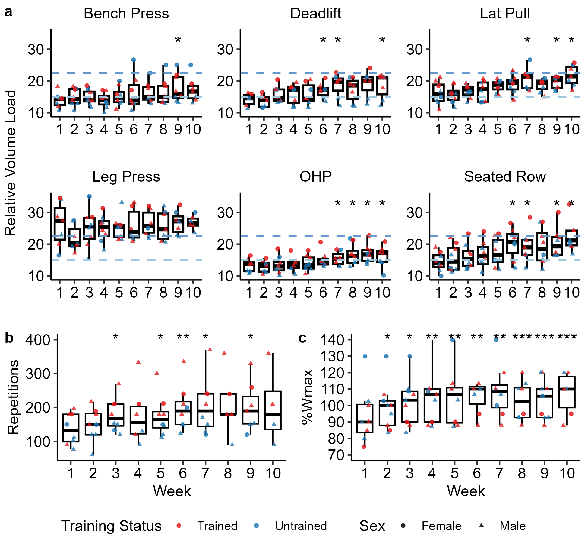

# Maximal Returns Protocol (MRP)

Analysis code for a time-efficient concurrent training intervention — 12 weeks, 1 hour/week, combining HIIT + resistance training + HIFT plyometrics. Part of Dr. Jacob Bowie's dissertation work at the University of Connecticut.



*Weekly progression across the 12-week intervention.* **(a)** Per-exercise load progression with significance markers across six RT lifts. **(b)** Total weekly repetitions. **(c)** HIIT intensity (% Wmax). Color: trained (red) vs untrained (blue); shape: female (circle) vs male (triangle).

## Study design

- **Intervention**: 12 weeks, one 60-minute session per week. Each session = 15 min HIIT (cycle, 5 × 1 min at 85% Wmax) + 15 min single-set-to-failure resistance training across six multi-joint exercises + 10 min HIFT plyometric circuit.
- **Participants**: n = 9 recreationally active adults (4 aerobically trained, 5 untrained) tested at PRE, MID, and POST.
- **Funding**: NASA Connecticut Space Grant Consortium (P-1708).

## Key findings

- Significant within-subject strength gains across all 12 strength measures (PRE → POST *p* < 0.001).
- Effect sizes ranged from moderate to very large (Hedges' *g* = 0.49–1.54).
- Lower-body lifts showed the largest adaptations (10RM Deadlift *g* = 1.54).
- VO₂max improved in aerobically trained participants (*p* = 0.016, *g* = 0.68).
- Maximal power output (Wmax) increased progressively across the intervention.
- Running economy and body composition were maintained.

Given n = 9 with no control group, inferential results are treated as **exploratory and hypothesis-generating** rather than confirmatory. The analysis is framed to inform powering of a future controlled trial.

## Repo layout

```
MRP/                              # repo root = project root
├── 01_MRP_Analysis.Rmd           # Canonical analysis (Phases 0–10 refactor)
├── MRP.Rproj                     # RStudio project anchor
├── MRP.xlsx                      # Anonymized analytic dataset
│                                 #   (sheets: Strength, vo2data,
│                                 #   Exercise Session RT, HIIT, HIFT)
├── renv.lock                     # Dependency lock file
├── helpers/
│   ├── paths.R                   # Absolute-path anchoring on MRP.Rproj
│   ├── setup.R                   # Packages, seed, namespace conflicts
│   └── functions.R               # fmt_p, fmt_g, create_styled_kable,
│                                 #   Hedges' g, MRP color scales, labels
├── renv/                         # renv infrastructure (library/ gitignored)
├── legacy/                       # Earlier exploratory scripts (see legacy/README.md)
├── DATA/                         # Raw subject-level data — NOT TRACKED
├── LICENSE                       # MIT (code)
├── CITATION.cff                  # GitHub citation widget
└── README.md
```

## Rendering the analysis

```r
# Open MRP.Rproj in RStudio (working directory = repo root)
renv::restore()                         # restore package versions
rmarkdown::render("01_MRP_Analysis.Rmd")
```

The rendered `01_MRP_Analysis.html` is self-contained. YAML parameters (`show_all_plots`, `save_pdfs`, `save_outputs`, `cache`) can be overridden via `render(params = ...)` for batch runs that emit polished xlsx tables alongside the HTML.

## Analysis structure

The canonical Rmd is organized around five research questions, each mapping to a labeled section:

1. **Within-subject change** (PRE → POST) — mixed-effects models per outcome (`lmer` with subject random intercept), Tukey-adjusted contrasts via `emmeans`.
2. **Magnitude of adaptation** — Hedges' *g* with small-sample correction, plus % change per measure.
3. **Trained vs untrained response** — `Timepoint × TrainingStatus` interaction; flagged as exploratory secondary given subgroup sizes.
4. **Intermediate trajectory** — PRE / MID / POST shape for measures with mid-intervention testing.
5. **Dose–response within RT** — cumulative weekly volume-load progression vs individual strength gain.

Two sensitivity analyses follow the primary results:

- **Sex-adjusted refit** of every primary LMM (adds `Sex` as a fixed effect), comparing Type III p-values against the unadjusted models and flagging α = .05 crossings.
- **Baseline-adjusted ANCOVA** (`POST ~ TrainingStatus + PRE`) across all PRE/POST outcomes, with a parallel-slopes diagnostic and `β(PRE)` reported per measure to make regression-to-the-mean visible.

## Design notes

- Tables use `cell_spec` conditional formatting via `fmt_p()` / `fmt_g()`: significant p-values in blue, moderate-or-larger effect sizes in red. Never `column_spec(..., bold = TRUE)` (silently overrides per-cell styling).
- Figures use a custom blue palette (`#00205B` / `#6699CC` / `#A0C9E0`) for PRE / MID / POST.
- Hand-written prose paragraphs are preserved alongside auto-generated, inline-computed prose blocks (blue-bordered divs) — useful for diffing the two truth sources during reviewer revision.
- Caching is disabled project-wide (`cache: FALSE`) — repeatedly bit by stale cache masking real bugs during refactor.
- Project root is anchored on `MRP.Rproj` via `helpers/paths.R`; chunk working directories are absolute, so knitr's per-chunk WD restoration cannot break path resolution.

## Provenance of earlier scripts

The `legacy/` directory contains dated `.Rmd` and `.R` files from earlier stages of the analysis (`script.R`, `Session_script.R`, `chatGPT_script.R`, `TvU Script.R`, `03142025 MRP_Markdown.Rmd`, etc.). These are preserved as a historical record of how the analysis evolved, not as parts of the canonical pipeline. They contain hard-coded local paths (`C:/MRP`, `G:/My Drive/...`) from the original Windows + Google Drive workflow and are not expected to run on a clean clone — use `01_MRP_Analysis.Rmd` for any actual rendering. See [`legacy/README.md`](legacy/README.md) for a file-by-file index.

## Data

- **`MRP.xlsx`** (tracked) is the IRB-approved anonymized analytic dataset. Subjects are coded `SUB <n>`; no direct identifiers.
- **`DATA/`** (not tracked, gitignored) holds raw per-subject material — consent forms, physician clearance, PARQ, HR/HRV exports, Polar JSONs. These remain on the lab share for provenance.
- HR/HRV / Polar-session data from two participant cohorts has been recovered into `DATA/` for a future scope expansion; it is **not used by the analyses in this repo**.

## Reproducibility

- **R 4.5.2** (last verified 2026-04-09).
- Package versions pinned in `renv.lock`; restore with `renv::restore()`.
- Reproducibility seed: `set.seed(0308)` in `helpers/setup.R` (applied before any stochastic call).

## Status

The MRP manuscript was submitted to the *Journal of Strength and Conditioning Research* as a Research Note (Sept 2025). The journal returned a priority-fit rejection (Feb 2026) with constructive methods-level feedback — reframe as exploratory pilot / proof-of-concept, expand methods, drop overreach to military / spaceflight populations. The analyses in this repo (including the sex-adjusted + ANCOVA sensitivity additions) implement that revision plan; resubmission to an alternative outlet is in progress.

## Cite

If you use this analysis pipeline or build on its design, please cite the repository via the GitHub "Cite this repository" widget (sourced from [`CITATION.cff`](CITATION.cff)) or:

> Bowie, J. (2026). *Maximal Returns Protocol — analysis pipeline.* [Software]. https://github.com/JacobBowie/MRP

## License

- **Code** — MIT (see [`LICENSE`](LICENSE)).
- **`MRP.xlsx`** — anonymized analytic data, available for academic non-commercial use; please cite the repository if used.
- **Raw subject-level data in `DATA/`** is not distributed; contact the author for collaboration inquiries subject to IRB approval.
